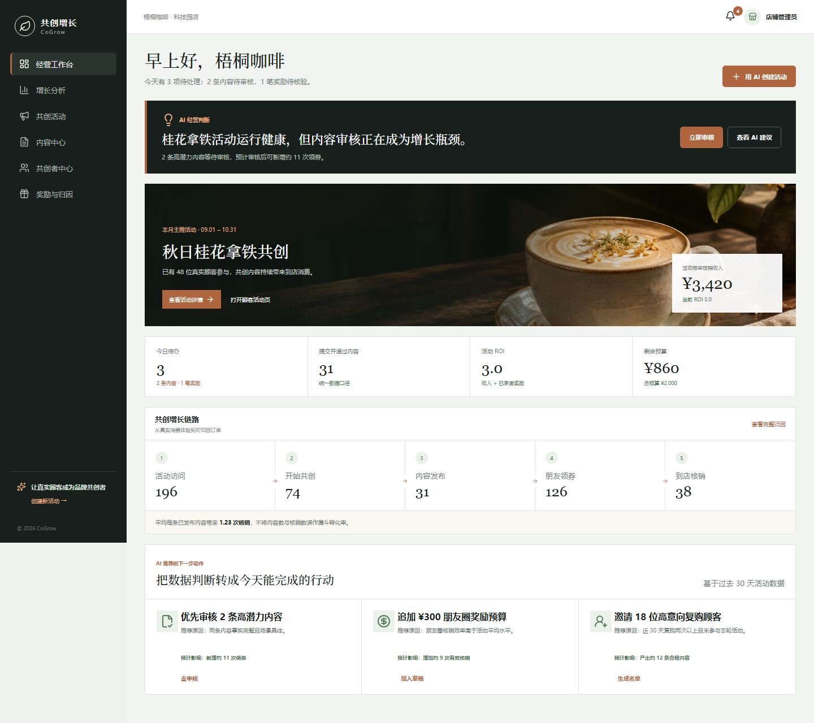
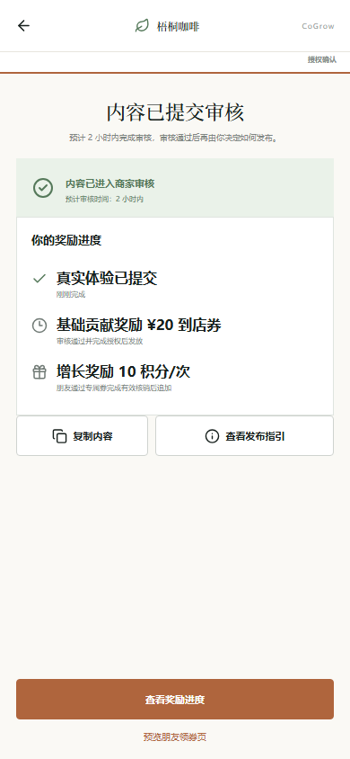
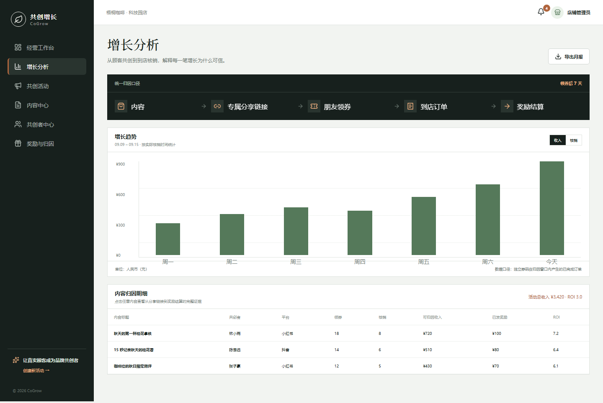

# 共创增长 CoGrow

面向电商与本地生活商家的 AI 顾客共创营销与增长归因工具。

CoGrow 将真实消费体验转化为可授权、可传播、可归因、可激励的营销内容。商家创建共创活动，顾客确认真实体验并生成适配不同平台的内容，系统再通过专属链接、优惠券和订单核销追踪增长贡献。

[在线体验](https://suze-d9gcny3z60fbc4dc6-1445532164.tcloudbaseapp.com/cogrow/)



## 产品闭环

```text
真实消费
  → 邀请顾客参与
  → AI 提取并确认体验事实
  → 生成多平台内容
  → 顾客确认授权
  → 内容审核与发布
  → 朋友领券
  → 到店核销
  → 贡献奖励
  → AI 经营建议
```

## 核心能力

- **AI 经营行动中心**：识别活动瓶颈，并把数据判断转化为可执行建议。
- **AI 活动工作室**：根据商品、人群、目标和预算生成活动方案与增长预测。
- **真实体验共创**：先确认顾客表达的事实，再生成小红书、抖音和朋友圈版本。
- **内容审核与授权**：分别管理内容审核、素材授权和发布状态。
- **增长归因**：通过独立分享链接、券码和订单追踪领券、核销及可归因收入。
- **贡献激励**：按合格内容、内容质量和有效核销解释并发放奖励。

## 关键界面

| 顾客授权与奖励进度 | 内容归因分析 |
| --- | --- |
|  |  |

## Demo 数据

| 指标 | 数据 | 指标 | 数据 |
| --- | ---: | --- | ---: |
| 活动访问 | 196 | 开始共创 | 74 |
| 通过内容 | 31 | 朋友领券 | 126 |
| 到店核销 | 38 | 可归因收入 | ¥3,420 |
| 已承诺奖励 | ¥1,140 | 活动 ROI | 3.0 |

所有页面共用同一套数据口径。待审核内容不会提前计入发布、领券或核销结果。

## 技术实现

- React 19 + TypeScript
- Vite
- React Router
- Playwright
- 本地事件模型与版本化浏览器存储
- 响应式商家后台与移动顾客端

当前版本使用前端模拟数据验证产品闭环。AI 方案生成和平台内容生成封装在独立服务层，后续可替换为真实模型、CRM、订单、券码和支付服务。

## 本地运行

```bash
npm install
npm run dev
```

默认地址：`http://127.0.0.1:5173/`

## 质量检查

```bash
npm run lint
npm run build
npm run test:e2e
```

自动化测试覆盖领域事件、活动方案生成、顾客共创闭环、内容审核、归因详情和奖励发放。

## 主要路由

| 路由 | 页面 |
| --- | --- |
| `/` | AI 经营工作台 |
| `/campaigns/new` | AI 活动工作室 |
| `/content` | 内容中心 |
| `/analytics` | 增长分析 |
| `/rewards` | 奖励与归因 |
| `/c/autumn-osmanthus` | 顾客活动页 |
| `/share/osmanthus-linyu` | 朋友领券页 |
| `/redeem/osmanthus-linyu` | 门店核销页 |
